# About
This is a collection of some computer vision projects implemented with Python and some Python library like opencv, numpy and scipy.

# PhotoDemosaic
This is a project for demosaic photos. 

For this problem, the "mosaic" image was created by taking the original color image and keeping only one color component for each pixel, according to the standard Bayer pattern:

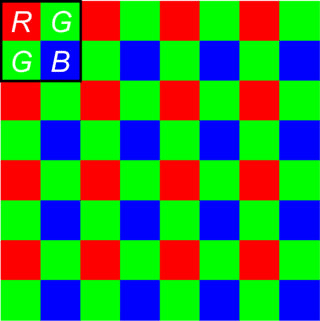

So, once you read the "mosaic" image into a matrix, entry (1,1) will be the value of the "red" component for pixel (1,1), entry (1,2) will be "green", etc.

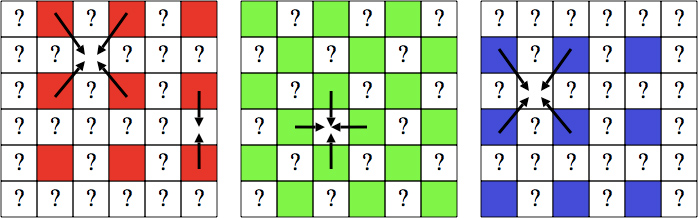

This Projects implemented the Linear Interpolation and The Freeman Method to do photo demosiac 

#### A Little Demo
Before:
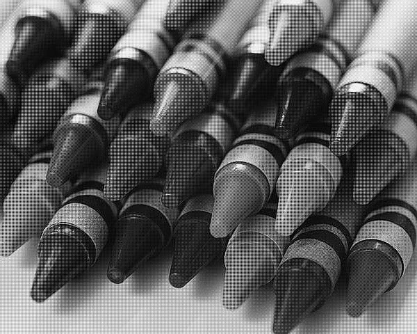
After:
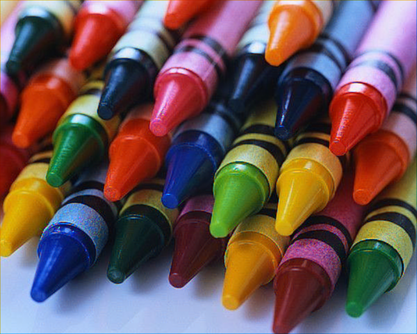

# Shape from shading
Get the shape of faces from the shading parameters

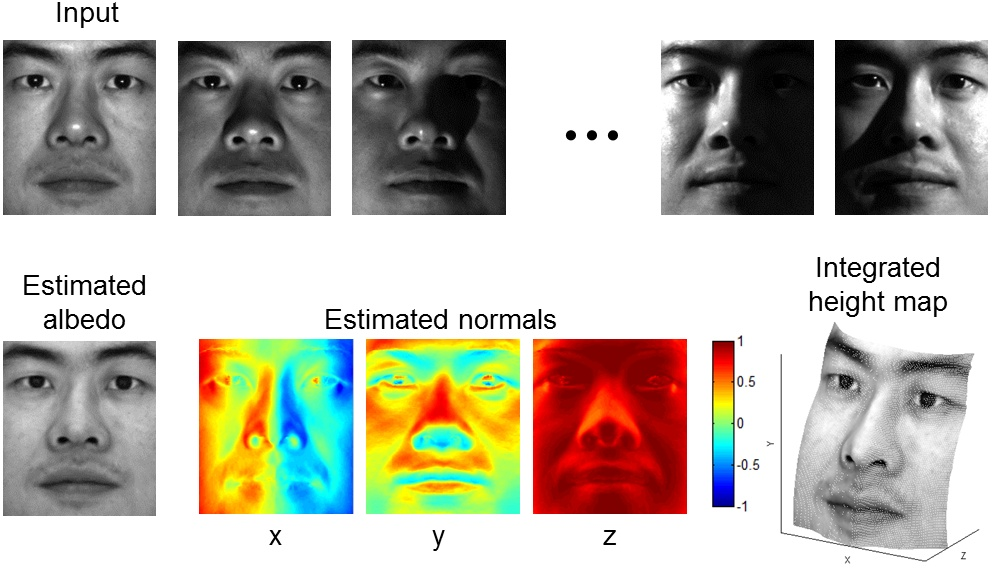

# Hybrid Images
This problem is to creat hybrid images use the technique described in this SIGGRAPH 2006 paper by Oliva, Torralba, and Schyns (see also the end of this lecture). Hybrid images are static images with two interpretations, which changes as a function of the viewing distance. Consider the example below. Figures A and B are the input images of a cereal box and its contents respectively. Figures C and D are the same hybrid image displayed at different resolutions. When we view the hybrid image at its normal size we see the cereal box and when we zoom out we see the bag of cereal. 

# Scale-space blob detection
The goal of this is to implement a Laplacian blob detector.

#### Algorithm outline
1. Generate a Laplacian of Gaussian filter.
2. Build a Laplacian scale space, starting with some initial scale and going for n iterations:
3. Filter image with scale-normalized Laplacian at current scale.
4. Save square of Laplacian response for current level of scale space.
5. Increase scale by a factor k.
6. Perform nonmaximum suppression in scale space.
7. Display resulting circles at their characteristic scales.

#### Example

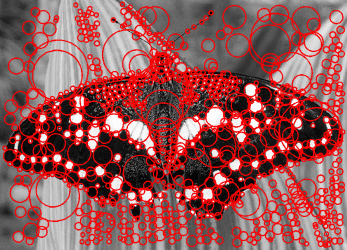

# Robust estimation and geometric vision
This project implemented homography and fundamental matrix estimation to register pairs of images, as well as attempt camera calibration, triangulation, and single-view 3D measurements.

#### Stitching pairs of images
The first step is to write code to stitch together a single pair of images. Below is a little example:
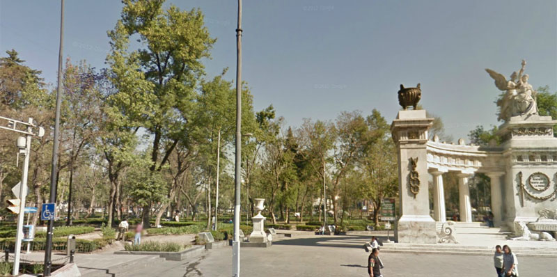
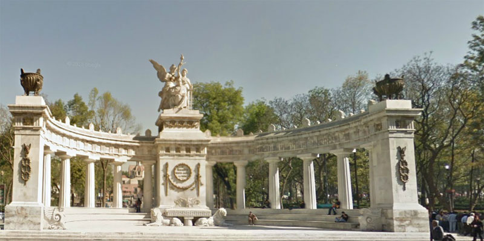

Result:
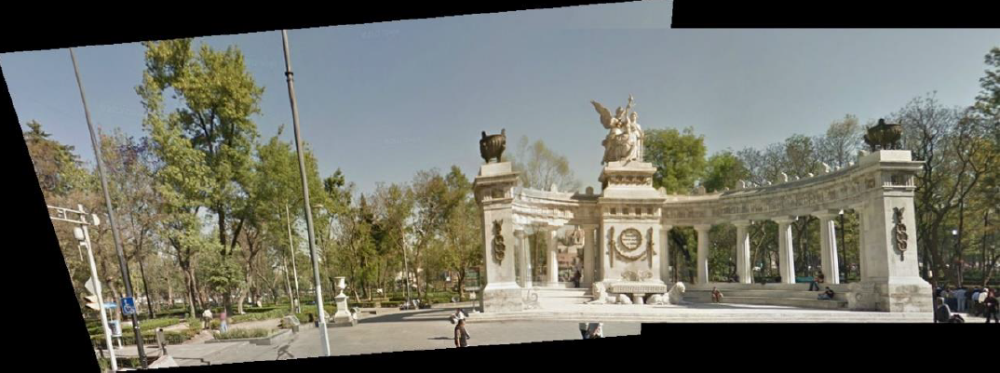

#### Single-View Geometry
Estimating height of objects in images according to anotehr object

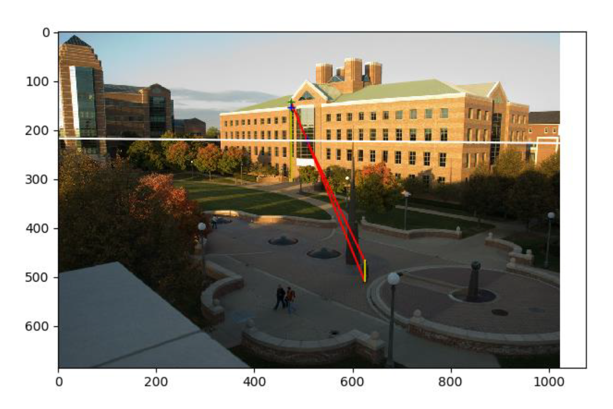

# Deep Learning
Using Pytorch to design and train deep convolutional neural networks. Starting from a baseline architecture of CIFAR100 with architecture below:
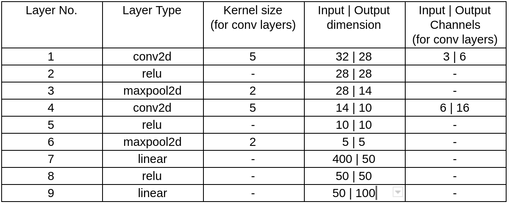

#### Methods to optimize the model:

1. Data normalization. Normalizing input data makes training easier and more robust. Similar to normalized epipolar geometry estimation, data in this case too could be made zero mean and fixed standard deviation (sigma=1 is the to-go choice). Use transforms.Normalize() with the right parameters to make the data well conditioned (zero mean, std dev=1) for improved training. 

2. Data augmentation. Using transforms.RandomCrop() and/or transforms.RandomHorizontalFlip() to augment training data.

3. Deeper network. Following the guidelines laid out by this lecture on CNN, experiment by adding more convolutional and fully connected layers. Add more conv layers with increasing output channels and also add more linear (fc) layers.

4. Normalization layers. Normalization layers help reduce overfitting and improve training of the model. Pytorch's normalization layers are an easy way of incorporating them in your model. Add normalization layers after conv layers (nn.BatchNorm2d). Add normalization layers after linear layers and experiment with inserting them before or after ReLU layers (nn.BatchNorm1d).

5. Early stopping. After how many epochs to stop training? This answer on stackexhange is a good summary of using train-val-test splits to reduce overfitting. 

## Miscellaneous
This is a collection of course projects I have done for UIUC course computer vision